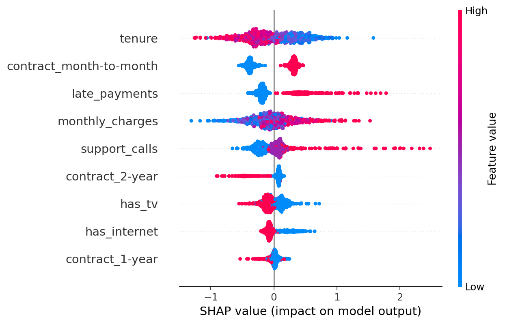

- logistic regression baseline
- probability calibration (Platt / Isotonic)
- threshold selection under precision constraint
- drift detection using PSI

Baseline (Log Reg):

- ROC-AUC: 0.69
- PR-AUC: 0.78
- F1: 0.77

PSI drift score (train vs next_month):
- Mean PSI: 0.007 (no significant drift detected)

Decision threshold selected under minimum precision constraint of 0.65

### ROC 

### PR 

### Reliability Diagram

## SHAP

