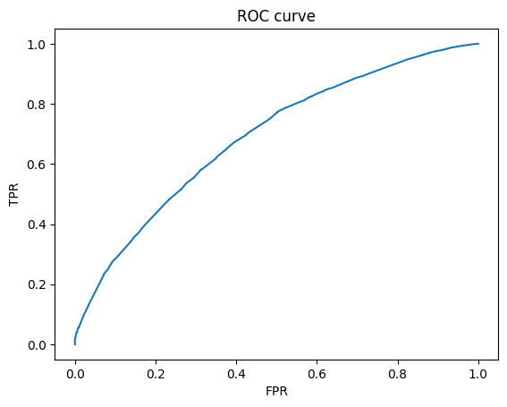
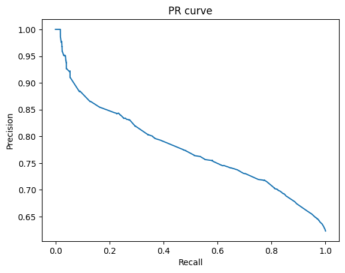
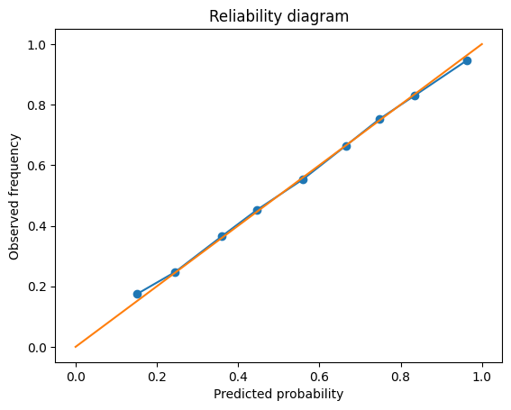

- logistic regression baseline
- probability calibration (Platt / Isotonic)
- threshold selection under precision constraint
- drift detection using PSI
- reproducible artifacts (model, metrics, plots)

Baseline (Logistic Regression):

- ROC-AUC: 0.69
- PR-AUC: 0.78
- F1 (precision-constrained threshold): 0.77

Calibration improved probability reliability while preserving ranking quality.

PSI drift score (train vs next_month):
- Mean PSI: 0.007 (no significant drift detected)

Decision threshold selected under minimum precision constraint of 0.65

### ROC Curve

### PR Curve

### Reliability Diagram

